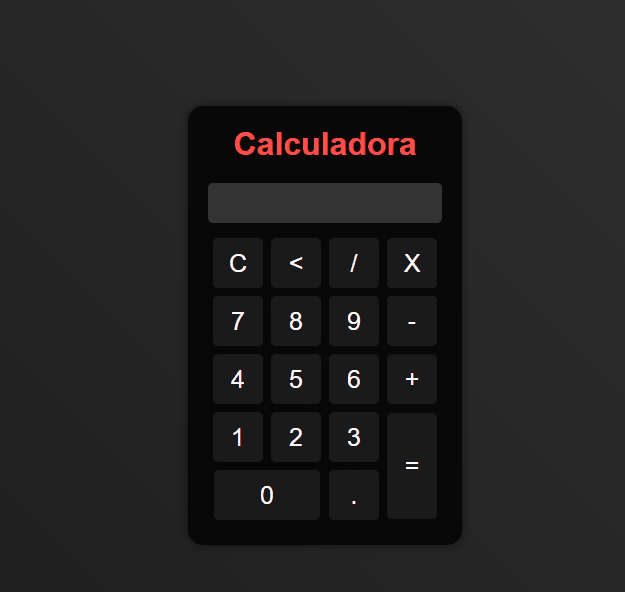

  <h1>Calculadora</h1>
  

> ## Descrição
   Uma simples calculadora implementada em HTML, CSS e JavaScript.

> ## Tecnologias

  - HTML
  - CSS
  - JavaScript

> ## Como usar

1. Faça o clone deste repositório: {{repositorio}}
2. Abra o arquivo `index.html` no seu navegador.
3. Utilize os botões na calculadora para realizar operações matemáticas.
   - Botão "C": Limpa o visor.
   - Botão "<": Apaga o último dígito.
   - Botão "/": Adiciona a operação de divisão.
   - Botão "X": Adiciona a operação de multiplicação.
   - Botões numéricos de 0 a 9: Adicionam os respectivos números ao visor.
   - Botão "-": Adiciona a operação de subtração.
   - Botão "+": Adiciona a operação de adição.
   - Botão ".": Adiciona um ponto decimal.
   - Botão "=": Calcula o resultado da expressão.

> ## Principais aprendizados

- Implementação de uma interface de calculadora simples em HTML e CSS.
- Manipulação do DOM utilizando JavaScript para realizar operações de cálculo.
